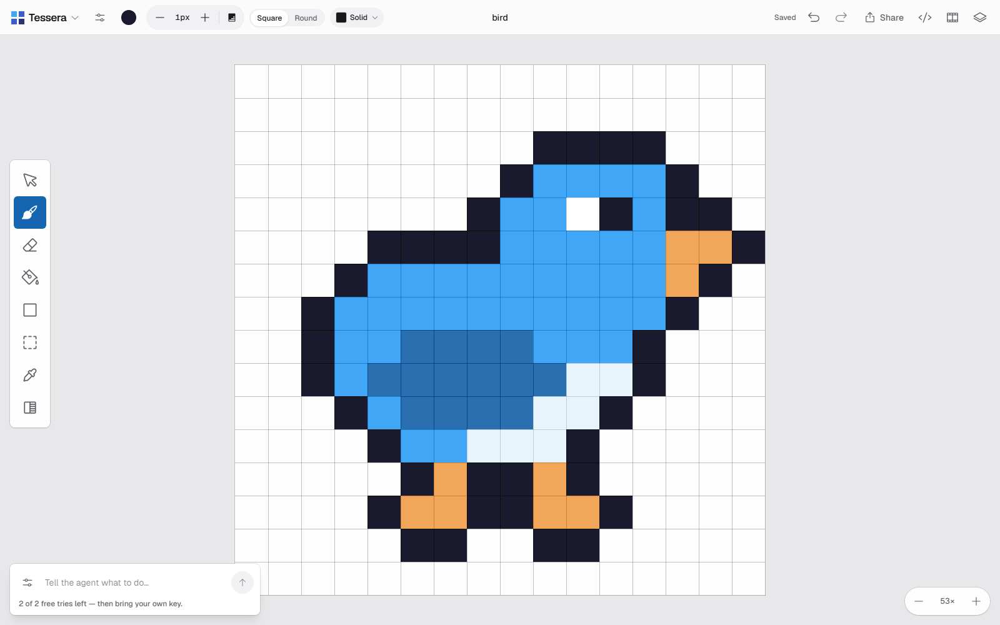
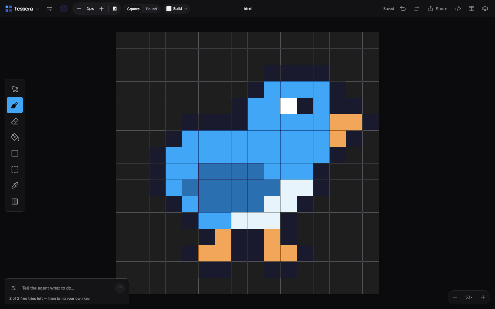
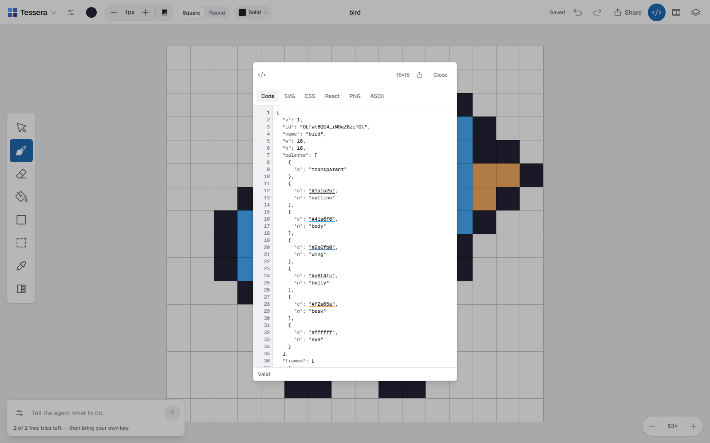
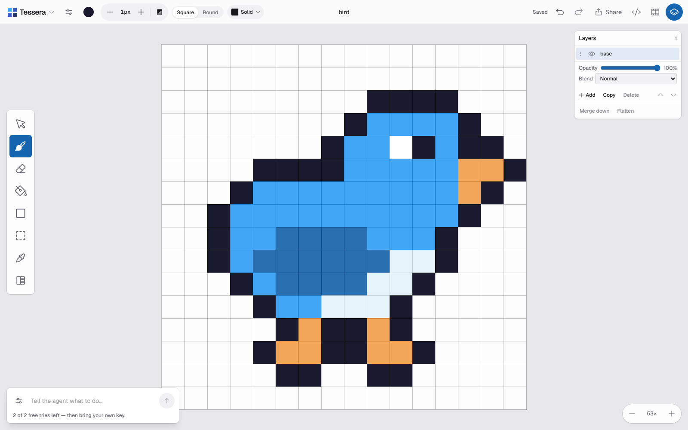
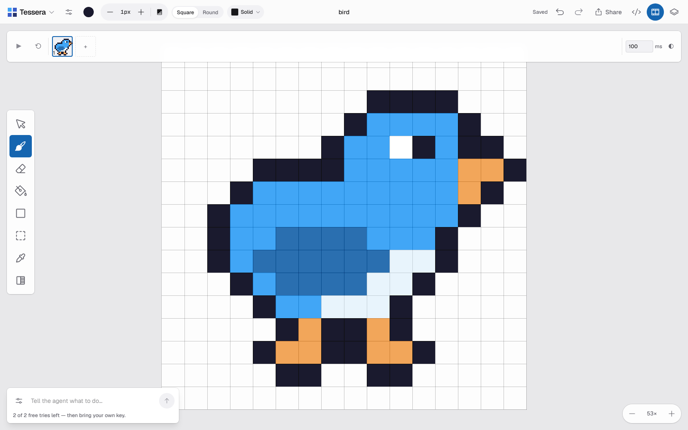

# Tessera

**Pixel art, code underneath.**

A code-native pixel-art editor with an AI editing agent. You paint on a canvas; underneath, every
pixel is an index into a palette, stored in JSON a human can read and hand-edit. Ask the AI to change
something and it proposes **structured pixel operations** — you see the diff and choose whether to
keep it.

```json
{
  "w": 16, "h": 16,
  "palette": [{ "c": "transparent" }, { "c": "#2d1b00" }, { "c": "#f4c430" }],
  "frames": [{ "ms": 100, "layers": [{ "n": "base", "px": [
    "................",
    ".....111111.....",
    "...1122222211...",
    "..122222222221.."
  ]}]}]
}
```

That is the whole format. One character per pixel: `.` is transparent, `1`–`9` and `a`–`z` are
palette indices. It is the file you export, the text the code panel shows, and the grid the AI reads.

## Screenshots

| Light | Dark |
|---|---|
|  |  |

| Code panel | Layers | Timeline |
|---|---|---|
|  |  |  |

## Running it

```bash
npm install
cp .env.example .env.local     # add a free Gemini key from aistudio.google.com/apikey
npm run dev                    # localhost:3000
```

No account needed — for you or for anyone using it.

## What works

- Brush, eraser, fill, eyedropper, shapes, gradient, select/move · palette · brush sizes and shapes ·
  symmetry (H/V/both)
- Layers — add, reorder, opacity, blend mode, merge down, flatten
- Timeline — multiple frames, per-frame timing, onion-skinning, animated export
- Code panel — the document's own JSON, editable both ways, plus one-click SVG, CSS, React, PNG, and
  ASCII export
- Undo/redo where one gesture is one step, not four hundred
- Zoom anchored at the cursor, pan, fit
- Autosave to IndexedDB — refresh and your drawing is still there
- **AI edits**: describe a change, see exactly which pixels it would touch, accept or reject.
  One `⌘Z` reverses the whole thing.
- Light and dark themes
- `⌘S` exports the document as JSON

## What doesn't, yet

**The AI produces valid edits that are not good edits.** It reads the artwork correctly, targets the
right region, and stays inside the canvas — and the results still aren't ones you'd keep. The Phase 0
probe run scored **0 of 9**, and that is written up honestly in
[`docs/PHASE-0-FINDINGS.md`](docs/PHASE-0-FINDINGS.md) with ranked hypotheses for the fix. The
plumbing is sound; the taste isn't there yet.

Also pending: sharing (parked — see [`docs/DEFERRED.md`](docs/DEFERRED.md)).

## How it's built

Next.js · TypeScript · Canvas 2D · Zustand · Gemini (free tier, behind a provider adapter)

```
lib/artwork-core/   the document model — imports nothing but zod, no React
lib/renderer/       pure canvas drawing
lib/ai/             context building, prompt, schemas, validation, provider adapter
lib/editor/         viewport maths, brush masks
docs/specs/         twelve sub-specs — the format, the protocol, the design system
```

Every AI operation passes ten validation gates and is applied to a *clone* before anything real is
touched, so a bad response cannot corrupt your artwork. The design is measured against the reference
product rather than guessed at — see [`docs/research/`](docs/research/).

## Credits

Inspired by the product concept of [Newt](https://newt.sh/) by Pablo Stanley. Newt is closed-source;
none of its code, branding, artwork, or copy is used here.

## Licence

MIT
